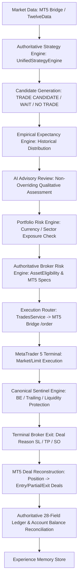
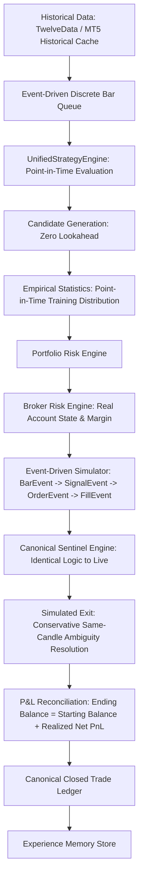
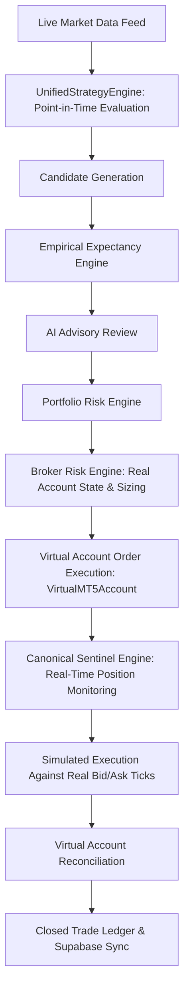

# TRADE-Z EXECUTION ARCHITECTURE & COMPLETE SYSTEM TRACE
## Mathematical Truth Engine & Live/Paper/Backtest Parity Specification

This document maps every execution path across LIVE, BACKTEST, and PAPER environments in the Trade-Z repository, identifying the single authoritative component for each responsibility, documenting duplicates to consolidate, and formalizing override boundaries.

---

## 1. End-to-End System Flows

### 1.1 LIVE Execution Flow

**Code Path:**
1. **Market Data:** `apps/mt5-bridge/mt5_bridge.py` (`/rates`, `/quote`) or `market_data.py` (`fetch_market_snapshot`).
2. **Strategy Engine:** `unified_strategy_engine.py` (`UnifiedStrategyEngine.evaluate_symbol`).
3. **Setup Evaluation:** 10 SMC setup families in `setup_families.py` evaluate structure, BOS, CHoCH, OB, FVG, liquidity sweeps.
4. **Candidate Generation:** Generates `TradeCandidate` or returns `WAIT` / `NO TRADE`. Strategy never triggers trades directly.
5. **Empirical Statistics:** `empirical_expectancy.py` (`EmpiricalExpectancyEngine.calculate_expectancy`). If sample size < 20, flags `INSUFFICIENT_STATISTICAL_EVIDENCE` and sets `empirical_win_probability = None`.
6. **AI Review:** `decoupled_ai_reviewer.py` / `chat.service.ts`. Advisory only. Cannot override risk or force order execution.
7. **Portfolio Risk:** `portfolio_risk.py` (`PortfolioRiskEngine.check_portfolio_risk`). Validates directional/currency correlation.
8. **Broker Risk:** `asset_eligibility.py` (`check_asset_eligibility`). Sizes volume via:
   $$\text{volume} = \min(\text{broker\_vol}, \text{risk\_vol}, \text{portfolio\_vol}, \text{margin\_vol})$$
   rounded DOWN to `volume_step`. Rejects if $< \text{min\_volume}$ (`UNEXECUTABLE_AT_BROKER_MIN_VOLUME`).
9. **Execution:** `trades.service.ts` (`executeTrade`) posts order to `apps/mt5-bridge/mt5_bridge.py` (`/order`).
10. **Position Management:** `sentinel_engine.py` / `sentinel_research.py` monitors open tickets, shifts to BE or trails.
11. **Exit & Reconstruction:** When closed, `mt5_bridge.py` reconstructs trades via `history_deals_get`, grouping partials and detecting deal reasons (`DEAL_REASON_SL`, `DEAL_REASON_TP`, `DEAL_REASON_SO`).
12. **Ledger & Memory:** Recorded in Supabase `trades` table and `experience_memory.py`.

---

### 1.2 BACKTEST Execution Flow

**Code Path:**
1. **Historical Data:** Mandatory historical DataFrame. If missing in production, returns `BACKTEST_DATA_UNAVAILABLE`.
2. **Strategy Engine:** `UnifiedStrategyEngine.evaluate_symbol` evaluated bar-by-bar at timestamp $T$. Higher timeframe (4H) candles are strictly filtered so any bar closing after $T$ is excluded.
3. **Setup Evaluation:** 10 SMC families evaluated without future price knowledge.
4. **Empirical Statistics:** Point-in-time empirical statistics.
5. **Portfolio & Broker Risk:** Same `PortfolioRiskEngine` and `AssetEligibility` used in Live. User-selectable balance ($20 to $10,000+), margin tracking, and strict volume sizing.
6. **Simulated Execution:** `event_driven_simulator.py` (`EventDrivenSimulator.run_simulation`) models spread, slippage, commission, swap, and limit queues.
7. **Same-Candle Ambiguity:** If `high >= TP` and `low <= SL` in the same bar, conservative policy executes Stop Loss first and logs `intrabar_resolution_method = "CONSERVATIVE_SL_ASSUMPTION"`.
8. **Position Management:** Sentinel Variant H (identical state machine as Live/Paper).
9. **Exit & Ledger:** Closed trades recorded into 28-field ledger.
10. **Reconciliation:** `ending_balance = starting_balance + sum(all net PnL)`. Peak-to-trough drawdown computed across each equity tick.

---

### 1.3 PAPER Execution Flow

**Code Path:**
Matches LIVE exactly until broker transmission: orders are fulfilled in `VirtualMT5Account` using real live market bid/ask quotes, tracking margin and equity identically to Live MT5 terminal.

---

## 2. Component Responsibility & Consolidation Matrix

| Responsibility | Authoritative Implementation | Duplicate / Conflicting Implementations | Callers | Inputs | Outputs | Override Rules |
| :--- | :--- | :--- | :--- | :--- | :--- | :--- |
| **Strategy & SMC** | `unified_strategy_engine.py` (`UnifiedStrategyEngine`) | `decision.py` (legacy 15-layer heuristic), `structure.py` ad-hoc scoring | Analysis API, Backtest Simulator, Live Scanner | Clean OHLCV DataFrame, Symbol, Timeframe, Broker Spec | `StrategyEvaluationResult` (`TRADE CANDIDATE`, `WAIT`, `NO TRADE`) | **Cannot execute orders directly.** Cannot be overridden by AI or caller. |
| **Empirical Statistics** | `empirical_expectancy.py` (`EmpiricalExpectancyEngine`) | Legacy `(score / 100) * 0.65` in `opportunity_engine.py`, synthetic priors | UnifiedStrategyEngine, OpportunityEngine, Backtest API | Historical closed trades, Symbol, Setup Family, Session, Regime | `EmpiricalExpectancyResult` (P(win), P(loss), P(BE), EV, Wilson CI) | **Quality score is a feature, NOT a probability.** Sample < 20 yields `UNKNOWN`. |
| **Portfolio Risk** | `portfolio_risk.py` (`PortfolioRiskEngine`) | None | UnifiedStrategyEngine, Backtester, Live Trader | Open positions, Correlation Matrix, Active Currencies | Approval status, max permitted risk USD | **Authoritative.** Rejects correlated currency over-exposure. |
| **Broker Risk & Sizing** | `asset_eligibility.py` (`check_asset_eligibility`) + `broker_profiles.py` | `mt5_bridge.py` (`max_affordable_loss = max(15.0, equity * 0.40)`), `risk.service.ts` (`pipValue = 10`) | UnifiedStrategyEngine, TradesService, Simulator | Equity, Free Margin, SL pips, Broker Symbol Specs | Approved volume, required margin, or Rejection Reason | **Nothing can override risk.** Sizing rounded DOWN to volume step; if $< \text{min\_vol}$, rejected (`UNEXECUTABLE_AT_BROKER_MIN_VOLUME`). |
| **Symbol Specifications** | `broker_profiles.py` (Dynamic MT5 Sync via `sync_from_mt5_symbol_info`) | Hardcoded pip values in NestJS `risk.service.ts` | AssetEligibility, Simulator, MT5 Bridge | MT5 `symbol_info` or curated broker profiles | Contract size, tick size, tick value, volume min/max/step | MT5 terminal specs are strictly authoritative. If missing, reject trade (`SYMBOL_SPEC_UNAVAILABLE`). |
| **Quantitative Simulator** | `event_driven_simulator.py` (`EventDrivenSimulator`) | `runInProcessBacktest` in NestJS `backtest.service.ts` (using `Math.random()`) | API `/api/v1/backtest/simulate`, `/tournament`, `/run` | Historical DataFrames, Initial Balance, Broker Specs | Closed Trades Ledger, Equity Curve, Reconciled Summary | **Sole authoritative backtester.** In-process random TypeScript simulator eliminated. If data missing -> `BACKTEST_DATA_UNAVAILABLE`. |
| **Trade Management (Sentinel)**| `sentinel_engine.py` / `sentinel_research.py` (Variant H) | Separate backtest trailing heuristics | Live Sentinel Daemon, EventDrivenSimulator | Open Position, Current Bar OHLC, ATR, Structure Levels | Modification Action (`SHIFT_BE`, `PARTIAL_CLOSE`, `TRAIL_SL`, `HOLD`) | **Shared canonical state machine across all modes.** |
| **Deal Reconstruction** | `mt5_bridge.py` (`_handle_history`) | Single-deal assumption (`pos_map[pid] = {'entry': None, 'exit': None}`) | Web History, TradesService Sync | MT5 History Deals (`history_deals_get`) | Reconstructed trade list with grouped partials, gross/net PnL, deal reason | Authoritative broker financial truth. Uses `deal.reason` (`SL`, `TP`, `SO`, `CLIENT`). |
| **User Authentication** | Supabase Cryptographic JWT Validation via `AuthService.getUser` | Plain base64 string splitting (`sub` claim) with fallback `'user-1'` | NestJS Controllers (`trades`, `broker`, `billing`, `chat`) | HTTP `Authorization: Bearer <token>` | Verified User UUID | **Unverified tokens and `user-1` fallbacks eliminated.** Rejects with 401 Unauthorized. |

---

## 3. Override Rules & Invariant Guarantees

1. **Risk Engine Invariance:** AI, Strategy, Frontend, and User parameters **cannot** override approved risk or lot size. Volume is clamped to the absolute mathematical minimum of broker, risk, portfolio, and margin limits.
2. **Lookahead Invariance:** At decision bar index $i$ (timestamp $T$), no data timestamped $> T$ can be observed by any indicator, structure detection, or higher-timeframe filter.
3. **Data Availability Invariance:** Backtesting with missing historical data must abort with `BACKTEST_DATA_UNAVAILABLE`. Synthetic candle generation is restricted to unit test suites.
4. **P&L Reconciliation Invariance:** Ending balance must equal starting balance plus the exact sum of all realized net P&L.
